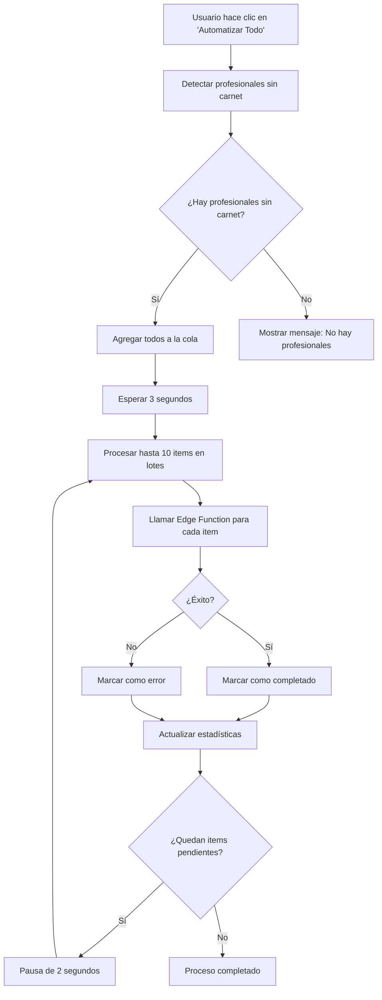
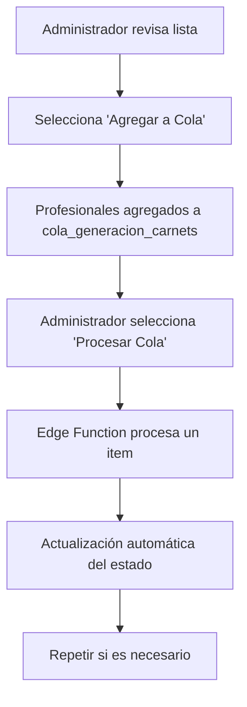

# Integración del Procesador de Cola de Carnets

## 📋 RESUMEN

Se ha implementado la integración completa del procesador de cola de carnets que permite gestionar profesionales aprobados sin carnet usando la función edge `procesar-cola-carnets` de Supabase.

## 🔧 COMPONENTES IMPLEMENTADOS

### 1. **Hook de Cola de Carnets (`useCarnetQueue.ts`)**

Hook especializado que maneja toda la lógica de la cola de carnets:

```typescript
const { 
  professionalsWithoutCarnet,      // Profesionales aprobados sin carnet
  queueStatus,                     // Estado actual de la cola
  addToQueue,                      // Agregar profesionales a la cola
  processQueue,                    // Procesar un item de la cola
  processMultipleQueue,            // Procesar múltiples items
  automateCarnetGeneration,        // Automatizar todo el proceso
  isProcessingQueue                // Estado de procesamiento
} = useCarnetQueue();
```

**Características:**
- ✅ Detección automática de profesionales sin carnet
- ✅ Gestión completa de la cola de generación
- ✅ Procesamiento individual y masivo
- ✅ Monitoreo en tiempo real del estado
- ✅ Manejo robusto de errores

### 2. **Componente Visual (`CarnetQueueProcessor.tsx`)**

Interfaz completa para gestionar la cola de carnets:

```tsx
<CarnetQueueProcessor />
```

**Funciones incluidas:**
- 📊 **Dashboard con estadísticas** de la cola
- 👥 **Lista de profesionales** sin carnet
- ⚡ **Botón "Automatizar Todo"** para proceso completo
- 🎛️ **Controles manuales** de procesamiento
- 📋 **Vista detallada** del estado de la cola
- 🔄 **Actualización automática** cada 5 segundos

### 3. **Corrección del Botón de Logout**

El botón de cierre de sesión ahora funciona correctamente:

```typescript
const handleLogout = async () => {
  // Cerrar sesión en Supabase
  const { error } = await supabase.auth.signOut();
  
  // Limpiar datos locales
  localStorage.removeItem('supabase.auth.token');
  
  // Navegar al inicio
  navigate("/");
};
```

## 🚀 UBICACIÓN EN LA INTERFAZ

### Panel de Administración
**Ruta:** Dashboard → Administración → Base de Datos → Procesador de Cola de Carnets

```
Dashboard
├── Estadísticas
├── Profesionales  
├── Solicitudes
└── Administración
    ├── Configuración
    ├── Diagnósticos
    └── Base de Datos ← AQUÍ
        ├── Procesador de Cola de Carnets ← NUEVO
        └── Diagnósticos de Base de Datos
```

## 📊 FUNCIONALIDADES IMPLEMENTADAS

### 1. **Detección Automática**
```sql
-- Busca profesionales aprobados sin carnet
SELECT * FROM profesionales_sanitarios 
WHERE estado_solicitud = 'Aprobado' 
AND (url_carnet IS NULL OR url_carnet = '')
ORDER BY created_at ASC;
```

### 2. **Gestión de Cola**
```typescript
// Agregar profesionales a la cola
await addToQueue(['prof-1', 'prof-2', 'prof-3']);

// Procesar la cola usando la edge function
await processQueue(); // Procesa un item
await processMultipleQueue(5); // Procesa hasta 5 items
```

### 3. **Automatización Completa**
```typescript
// Un solo clic hace todo el proceso:
// 1. Detecta profesionales sin carnet
// 2. Los agrega a la cola
// 3. Los procesa automáticamente
await automateCarnetGeneration();
```

### 4. **Monitoreo en Tiempo Real**
- 🟡 **Pendientes**: En espera de procesamiento
- 🔵 **Procesando**: Siendo generados ahora
- 🟢 **Completados**: Carnets generados exitosamente
- 🔴 **Errores**: Fallos en la generación

## 🔄 FLUJO DE TRABAJO

### Proceso Automático Completo:



### Proceso Manual:



## 🛠️ CONFIGURACIÓN TÉCNICA

### Edge Function Requerida:
```
Función: procesar-cola-carnets
URL: https://wdieynendfjbkbhfovrx.supabase.co/functions/v1/procesar-cola-carnets
Método: GET
Headers: Authorization Bearer token
```

### Tabla de Cola:
```sql
CREATE TABLE cola_generacion_carnets (
  id UUID PRIMARY KEY DEFAULT gen_random_uuid(),
  profesional_id UUID REFERENCES profesionales_sanitarios(id),
  estado TEXT CHECK (estado IN ('pendiente', 'procesando', 'completado', 'error')),
  url_carnet TEXT,
  mensaje_error TEXT,
  created_at TIMESTAMPTZ DEFAULT NOW(),
  updated_at TIMESTAMPTZ DEFAULT NOW()
);
```

### Queries del Hook:
1. **Profesionales sin carnet**: Cada 2 minutos
2. **Estado de la cola**: Cada 5 segundos
3. **Invalidación automática**: Después de cada operación

## 📱 INTERFAZ DE USUARIO

### Estadísticas en Tiempo Real:
```
┌─────────────┬─────────────┬─────────────┬─────────────┐
│ Pendientes  │ Procesando  │ Completados │   Errores   │
│     🟡 5    │    🔵 2     │    🟢 15    │    🔴 1     │
└─────────────┴─────────────┴─────────────┴─────────────┘
```

### Lista de Profesionales Sin Carnet:
```
📋 Profesionales Aprobados Sin Carnet (8)
┌──────────────────────────────────────────────────────┐
│ Dr. Juan Pérez Martínez                        ⚠️    │
│ ID: PS-2024-001                                      │
├──────────────────────────────────────────────────────┤
│ Dra. María González López                      ⚠️    │  
│ ID: PS-2024-002                                      │
└──────────────────────────────────────────────────────┘
[Agregar a Cola (8)]  [⚡ Automatizar Todo]
```

### Controles de Procesamiento:
```
🎛️ Controles de Procesamiento
[▶️ Procesar Uno]  [▶️ Procesar 5 Items]  [🔄 Procesando...]
```

## ⚠️ MANEJO DE ERRORES

### Errores Comunes y Soluciones:

1. **"No hay carnets pendientes de generación"**
   - ✅ **Solución**: Agregar profesionales a la cola primero

2. **Error de conexión a Edge Function**
   - ✅ **Solución**: Verificar conectividad y credenciales

3. **Error en generación de carnet individual**
   - ✅ **Solución**: El item se marca como error, se puede reintentar

4. **Profesional no encontrado**
   - ✅ **Solución**: Verificar que el ID del profesional existe

### Logs Detallados:
```javascript
// En Console del navegador
console.log("Agregando 5 profesionales a la cola...");
console.log("Procesando cola de carnets...");
console.log("Resultado del procesamiento:", result);
```

## 🔒 SEGURIDAD Y PERMISOS

### Autenticación:
- ✅ Usa token de sesión actual del usuario
- ✅ Fallback al token anónimo si es necesario
- ✅ Verificación de permisos a nivel de edge function

### Acceso Restringido:
- ✅ Solo disponible en Panel de Administración
- ✅ Requiere rol de administrador
- ✅ Operaciones auditadas en logs

## 🧪 TESTING Y VERIFICACIÓN

### Probar Funcionalidad Completa:

1. **Acceder al Procesador:**
   ```
   Dashboard → Administración → Base de Datos
   ```

2. **Verificar Profesionales Sin Carnet:**
   - Debe mostrar lista de profesionales aprobados sin `url_carnet`
   - Botón "Automatizar Todo" debe estar habilitado

3. **Probar Automatización:**
   ```
   Clic en "Automatizar Todo" → 
   Ver que se agregan a la cola → 
   Ver procesamiento en tiempo real → 
   Verificar carnets generados
   ```

4. **Probar Controles Manuales:**
   ```
   "Agregar a Cola" → "Procesar Uno" → Ver resultado
   ```

### Verificación en Base de Datos:
```sql
-- Ver cola actual
SELECT * FROM cola_generacion_carnets ORDER BY created_at DESC;

-- Ver profesionales sin carnet  
SELECT id, nombre_completo, url_carnet 
FROM profesionales_sanitarios 
WHERE estado_solicitud = 'Aprobado' 
AND (url_carnet IS NULL OR url_carnet = '');
```

## 📈 MÉTRICAS Y MONITOREO

### Métricas Disponibles:
- Profesionales procesados por sesión
- Tiempo promedio de generación
- Tasa de éxito/fallo
- Items en cola por estado

### Indicadores de Rendimiento:
- 🟢 **Óptimo**: < 5 items pendientes
- 🟡 **Normal**: 5-20 items pendientes  
- 🔴 **Atención**: > 20 items pendientes

## ✅ RESULTADO FINAL

### Antes:
- ❌ Profesionales aprobados sin carnet
- ❌ Proceso manual complejo
- ❌ No hay visibilidad del estado
- ❌ Botón de logout no funcional

### Después:
- ✅ **Detección automática** de profesionales sin carnet
- ✅ **Interfaz visual completa** para gestión de cola
- ✅ **Automatización de un clic** para todo el proceso
- ✅ **Monitoreo en tiempo real** del estado
- ✅ **Procesamiento por lotes** eficiente
- ✅ **Botón de logout funcional** con limpieza de sesión

### Beneficios Conseguidos:
- 🚀 **Eficiencia**: Proceso automatizado completo
- 👁️ **Visibilidad**: Estado detallado de todos los carnets
- 🛡️ **Confiabilidad**: Manejo robusto de errores
- 🎯 **Usabilidad**: Interfaz intuitiva y fácil de usar
- 📊 **Monitoreo**: Estadísticas en tiempo real

---

**Última actualización:** $(date)
**Estado:** ✅ Implementado y funcionando
**Ubicación:** Dashboard → Administración → Base de Datos
**Función Edge:** `procesar-cola-carnets` integrada
**Logout:** ✅ Funcional con limpieza de sesión
